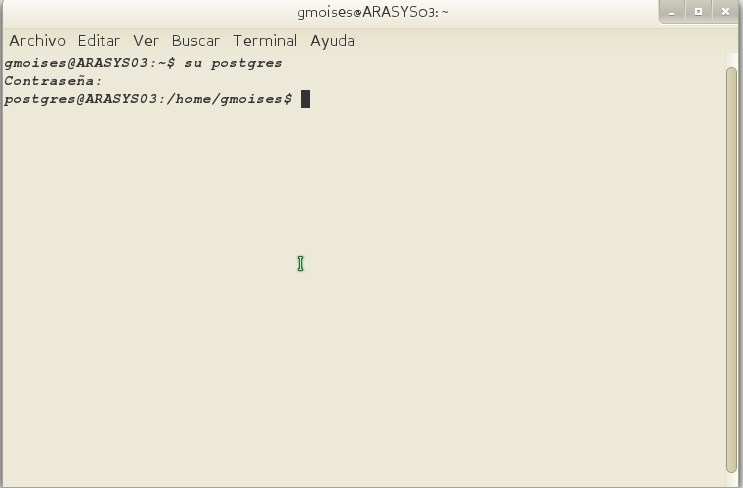
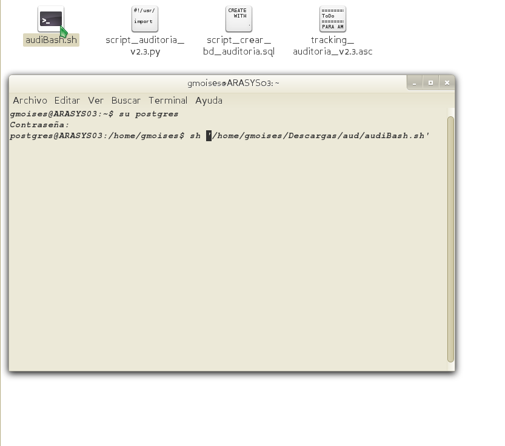
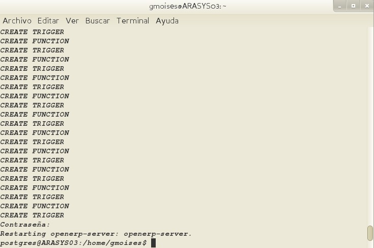
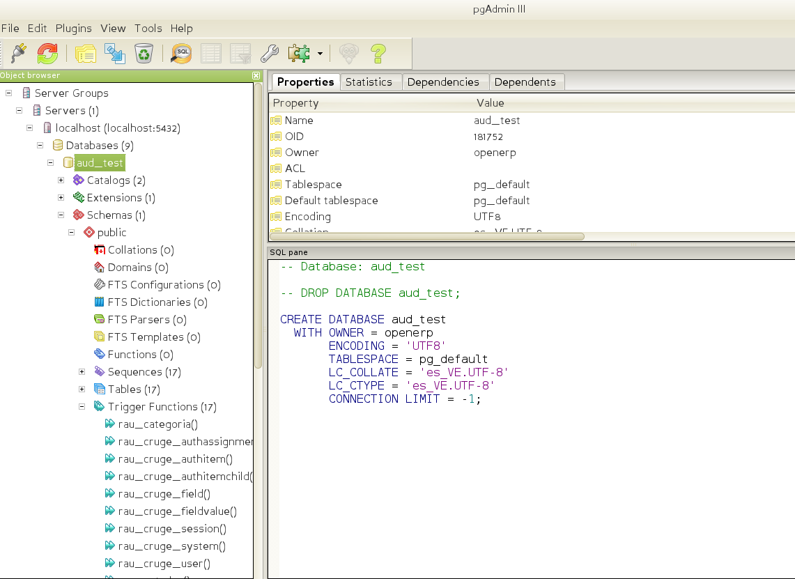

## Tutorial para la creación de BD auditoría a una BD Odoo
###### *Script v2.4 By Bachaco-VE*

1. Abrimos una consola y nos logueamos como usuario postgres.

>En caso de no saber cual es el password de postgres sencillamente como superusuario en consola “passwd postgres” le asignas la clave y retornas al paso uno (1)

2. Se ejecuta el archivo audiBash.sh escribiendo en consola “sh + arrastrar el archivo a la consola” + ENTER

3. En la consola se ve la creación de la base de datos, tablas, triger,etc. Al finalizar pide la contraseña de root para reiniciar el servidor de OPENERP para que este levante con los triggers ya activos.

4. Verificamos en la interfaz de pgadmin3 la creación de la BD.
